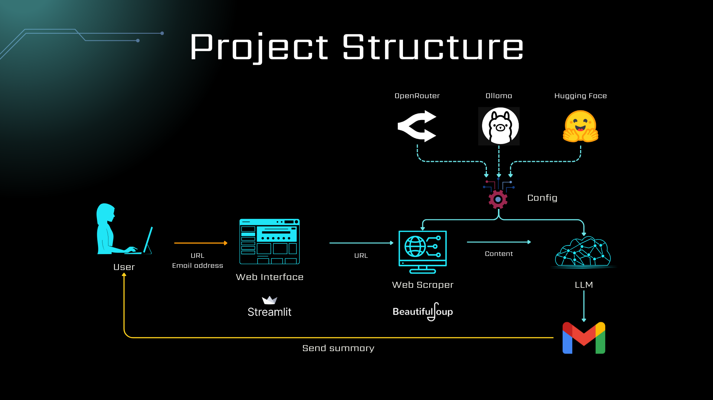

# Web Summarizer Using LLMs (Large Language Models) with VastAI Deployment

This project enables automated summarization of web pages using powerful large language models (LLMs). It supports a wide range of LLM providers:
- [Ollama](https://ollama.com/) (Runs locally, make sure it's installed.)
- [Hugging Face Inference API](https://huggingface.co/models)
- [OpenRouter](https://openrouter.ai/models)

The tool offers a simple and intuitive Streamlit interface, allowing users to input a URL and receive a concise summary of the page — optionally delivered via email. It is deployed on both the **Streamlit Share Server** (Public link: https://genai-web-summarizer.streamlit.app/) and **[VastAI](https://vast.ai/)** server.

<div align="center">


</div>

## Key Features
- Extracts and summarizes web content using configurable LLMs.
- Multi-provider support: Hugging Face, OpenRouter, Ollama.
- Customizable prompt for summarization.
- Option to send summary via email.
- Easily deployable on VastAI or any Streamlit-supported environment.

## Project Structure

### Configuration

- [config.json](config/config.json): Main configuration file to select LLM provider and its model. In the case of Hugging Face and OpenRouter providers, make sure to create an access token with the appropriate permissions.
- [config_loader.py](src/config_loader/config_loader.py): Loads config and selects the first enabled model. Raises an error if none are configured.
- [prompt.txt](config/prompt.txt): Customize the summarization prompt for specific use cases or formats.

### The Application

1. Loads credentials (email & API keys) from `.env` file.
2. Scrapes the webpage using a built-in web scraper.
3. Sends content to the selected LLM for summarization.
4. Displays summary in the UI and optionally sends it to the user via email using SMTP.

<div style="text-align: center;">
    
</div>

## VastAI Configuration for Model Deployment
1. Template Selection:
    - For the template choice, it is highly recommended to use a template that already has Ollama installed (e.g., [Open Webui Ollama](https://cloud.vast.ai/?ref_id=277963&creator_id=277963&name=Open%20Webui%20(Ollama)) template). Otherwise, you can choose any other template and install Ollama by running the following command:
        ```bash
        curl -fsSL https://ollama.com/install.sh | sh
        ```
    - ⚠️ Make sure to open port 8501 in the Docker options section.

2. Instance Requirements:
    - Choose a VastAI instance that has the following requirements:
        - 12GB+ of RAM
        - 60GB+ of disk space (Ollama models can be quite large)
    - Add your public SSH key and reboot the instance to connect

3. Setup Instructions:
    - Connect to your instance via SSH
    - Create a new directory named `mlops`
    - Inside this directory, clone the repository using the following command:
        ```bash
        git clone https://github.com/Lahdhirim/GENAI-web-summarizer-vastai.git
        cd GENAI-web-summarizer-vastai
        ```
    - Install the required dependencies using pip:
        ```bash
        pip install -r requirements.txt
        ```
    - Inside the `GENAI-web-summarizer-vastai` directory, create a new file named `.env` with your variables, following the format provided in `.env.example`:
        - `HUGGINGFACE_API_KEY`: Your Hugging Face API key (if you are using Hugging Face)
        - `OPENROUTER_API_KEY`: Your OpenRouter API key (if you are using OpenRouter)
        - `EMAIL_HOST`=smtp.gmail.com
        - `EMAIL_PORT`=587
        - `EMAIL_ADDRESS`: Your email address
        - `EMAIL_PASSWORD`: Your email app password **(⚠️ Not your account password)**. You can generate an app password in your Gmail account after enabling two-step verification (see [this link](https://support.google.com/mail/answer/185833?hl=en)).

4. (Optional but recommended) Test the Streamlit application from the terminal to ensure that the application runs correctly:
    ```bash
    streamlit run main.py
    ```

5. Automatically launch Streamlit app on instance startup:
    - In the `/workspace` directory, create a new file named `onstart.sh` with the following content:
        ```bash
        #!/bin/bash
        echo "Starting onstart.sh at $(date)" >> /tmp/onstart.log

        # Launch Streamlit
        echo "Running Streamlit..." >> /tmp/onstart.log
        /venv/main/bin/streamlit run /workspace/mlops/GENAI-web-summarizer-vastai/main.py >> /workspace/mlops/GENAI-web-summarizer-vastai/app.log 2>&1 &

        echo "Streamlit started with PID $!" >> /tmp/onstart.log
        ```
    
    - Make the script executable:
        ```bash
        chmod +x /workspace/onstart.sh
        ```

    - For some VastAI templates, the file `entrypoint.sh` is used by default during the instance startup. You can modify this file to add the following line:
        ```bash
        bash /workspace/onstart.sh >> /tmp/onreboot_streamlit.log 2>&1 
        ```

## Extending the Tool
To add support for another LLM (e.g., OpenAI):
- Create a new config class in [config_loader.py](src/config_loader/config_loader.py) (e.g., `OpenAIConfig`).
- Implement a new model handler in [llm.py](src/modeling/llm.py), inheriting from `BaseLLM` abstract class.

## Notes & Considerations
- Some websites actively block scraping. You may need to use headers or proxies.
- Always review rate limits for your chosen LLM provider.
- Use environment variables securely, especially when deploying to public or shared servers.